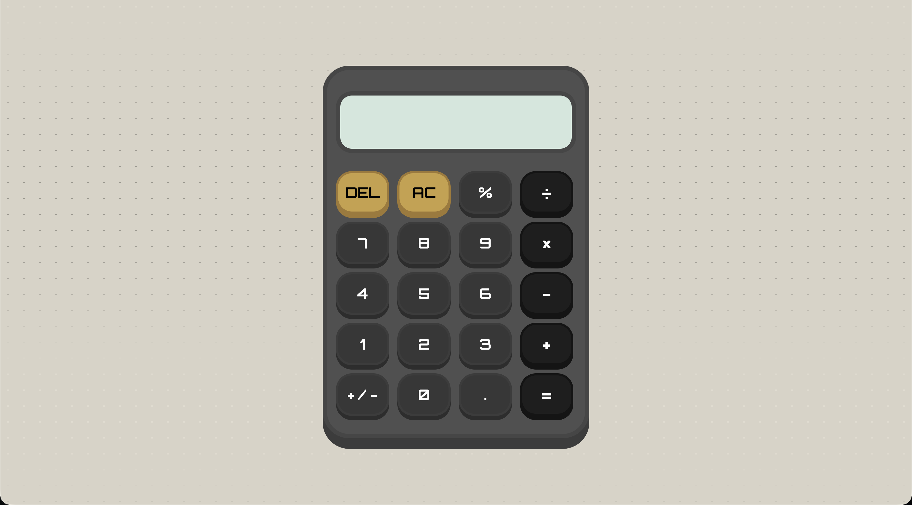

# calculator

## About this Project

This is my final JavaScript project for the foundations course. It feels really rewarding accomplishing it & I'm more than excited to continue!

This project is a task from The Odin Project, a structured full stack development course. You can learn at your own pace and it starts from 0 to getting employed. I highly recommend taking this course. More on [The Odin Project](https://www.theodinproject.com/).

## Live Demo

Visit the page online: [Calculator](https://axhis8.github.io/calculator/)

## Features

- Calculate with different operators (+, -, \*, /)
- Add decimals
- Percentage
- Clear & Delete digits
- Input History shown at the top of the Display
- Change the sign of the number
- Keyboard support
- 3D Button pressing effect
- Object Style based Syntax

## How to Use

- Use the onscreen buttons or the keyboard shortcuts
- Type digits (0–9) to enter numbers
- Use "%" for percentage
- Use "." for decimal points
- Press "Backspace" to delete a digit
- Press "Enter" to calculate the result
- Press "+/-" on screen to change the sign of a number

## Built With

- HTML5
- CSS3
- JavaScript

## What I Learned

- Handling Objects with JavaScript
- Working with CSS shadow boxes and borders
- JavaScript event handling and DOM manipulation
- Keyboard event handling
- Dealing with JavaScript rounding issues
- Writing clean and organized code

## Screenshot

